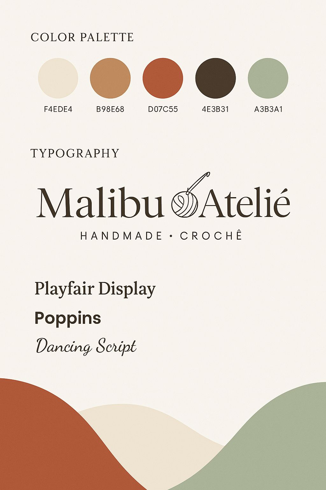

# Informações sobre o cliente
1. Nome do cliente: **Pricila Costa**
2. Nome da empresa: **Malibu Atelié**

# Descrição do projeto
### 1.  Titulo do projeto:
   Malibu Ateliê
### 2.  Breve resumo do projeto:
   Malibu Ateliê é um ateliê criativo localizado em Floriano, PI, especializado em crochê de moda sob medida. Fundado por Pricila, o espaço valoriza autenticidade, estilo, feminilidade e a conexão com a ancestralidade através do feito à mão. A marca transforma fios em arte, produzindo peças exclusivas para ocasiões marcantes como Carnaval, ensaios fotográficos, moda praia e looks personalizados.
### 3.  Objetivos do projeto
   Modernizar e profissionalizar a presença digital da Malibu Ateliê, criando uma experiência online que reflita sua identidade única. Isto será feito através do desenvolvimento de um link personalizado que funcione como um hub digital, reunindo o catálogo atualizado, redes sociais, portfólio e depoimentos de clientes, sempre com uma estética limpa, sofisticada e humanizada.
### 4. Publico-alvo:
   Mulheres que buscam exclusividade, beleza e personalidade, apreciando peças artesanais que unem qualidade e conexão com a tradição do feito à mão.

# Requisitos Básicos do Sistema

### 1. CRUD de Produtos
- **Cadastro:**
  - Nome do produto
  - Foto (upload ou link da imagem)
  - Descrição detalhada
  - Preços (único ou variações, se necessário)
- **Leitura:**
  - Visualização dos produtos cadastrados, com listagem detalhada e opção de pesquisa.
- **Atualização:**
  - Funcionalidade para editar as informações dos produtos existentes.
- **Exclusão:**
  - Mecanismo seguro para remoção de produtos do sistema.

### 2. Link Público para Clientes
- Gerar um link personalizado que exiba todas as informações dos produtos cadastrados.
- Interface pública responsiva e de fácil navegação, permitindo que os clientes visualizem imagens, descrições e preços.
- Design alinhado com a identidade visual da marca, com bom desempenho em dispositivos móveis e desktops.

### 3. Login Simples para o Gestor
- Sistema de autenticação com login simples (usuário e senha) para acesso ao painel administrativo.
- Painel que possibilite ao gestor gerenciar todas as funcionalidades do sistema, incluindo o CRUD dos produtos, de forma segura e intuitiva.
- Acesso restrito a usuários autorizados para garantir a segurança das operações e integridade das informações.

# Comunicação e aprovação
- Canal de comunicação preferencial: **Comunicação será por Whatsapp**
- Processo de aprovação: **Reuniões via meet mostrando o que foi desenvolvido e ver o que o cliente achou e se ele aprova ou não**

# Referencias Visuais

- [Favorito Croche](https://www.favoritocroche.com.br/?fbclid=PAZXh0bgNhZW0CMTEAAaeDIZLoJ9IrrLhc6WgzNphOQEjVtzsUHzjPX_xE0EKG_3sUBwSy9T5UTlkCkw_aem_Pdzcu7RuZ6XCa0Y2YDqWMg)
- Paleta de Cores e Fontes

